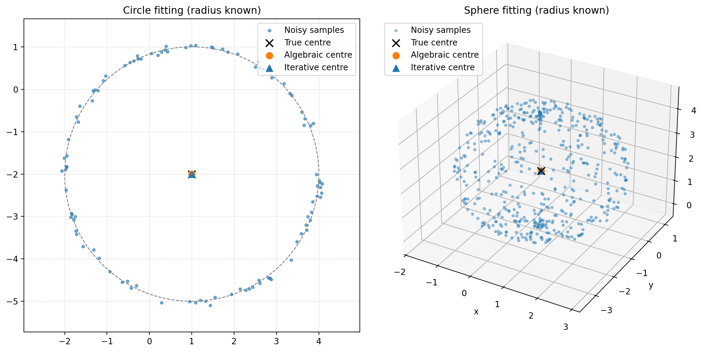

# Circle and Sphere Fitting with a Known Radius

Lightweight Python tooling for estimating the centre of a circle (2D) or sphere (3D) when the radius is known. Two complementary solvers are provided:

- **Algebraic (non-iterative)**: a single weighted least-squares solve built on a classic algebraic formulation.
- **Iterative (Gauss--Newton)**: refines the centre by minimising orthogonal distance residuals.

Each solver ships with an accompanying PDF note that details the underlying theory.

## Installation
```bash
python -m pip install -e .
```

## Usage
### Algebraic (Non-Iterative) Fit
#### Circle (2D)
```python
import numpy as np
from circle_sphere_fitting import fit_circle_known_radius_algebraic

points = np.array([
    [3.8, 0.2],
    [5.9, 2.8],
    [4.1, 5.7],
    [1.9, 2.9],
])
result = fit_circle_known_radius_algebraic(points, radius=3.0)
print(result.center)
print(result.rmse)
```

#### Sphere (3D)
```python
import numpy as np
from circle_sphere_fitting import fit_sphere_known_radius_algebraic

rng = np.random.default_rng(0)
true_center = np.array([0.5, -1.0, 2.0])
radius = 2.5
phi = rng.uniform(0.0, np.pi, size=200)
theta = rng.uniform(0.0, 2 * np.pi, size=200)
x = np.sin(phi) * np.cos(theta)
y = np.sin(phi) * np.sin(theta)
z = np.cos(phi)
points = true_center + radius * np.column_stack((x, y, z))
points += rng.normal(0.0, 0.02, size=points.shape)

result = fit_sphere_known_radius_algebraic(points, radius)
print(result.center)
print(result.rmse)
```

### Iterative Gauss--Newton Fit
#### Circle (2D)
```python
import numpy as np
from circle_sphere_fitting import fit_circle_known_radius_iterative

points = ...  # shape (n_samples, 2)
result = fit_circle_known_radius_iterative(points, radius=3.0, max_iter=50, tol=1e-10)
print(result.center)
print(result.iterations)
```

#### Sphere (3D)
```python
import numpy as np
from circle_sphere_fitting import fit_sphere_known_radius_iterative

points = ...  # shape (n_samples, 3)
result = fit_sphere_known_radius_iterative(points, radius=2.5, max_iter=100, tol=1e-10)
print(result.center)
print(result.iterations)
```
Supply `initial_center` when a better starting point is available (e.g. from the algebraic solver).

## Demo
```bash
python examples/demo.py
```
The script prints numerical comparisons and saves `examples/demo_output.png`, illustrating both methods on synthetic circle and sphere data.



## Theory Notes
- `docs/noniterative_method.pdf`: derivation of the algebraic least-squares formulation.
- `docs/iterative_method.pdf`: Gauss--Newton optimisation details and convergence considerations.
